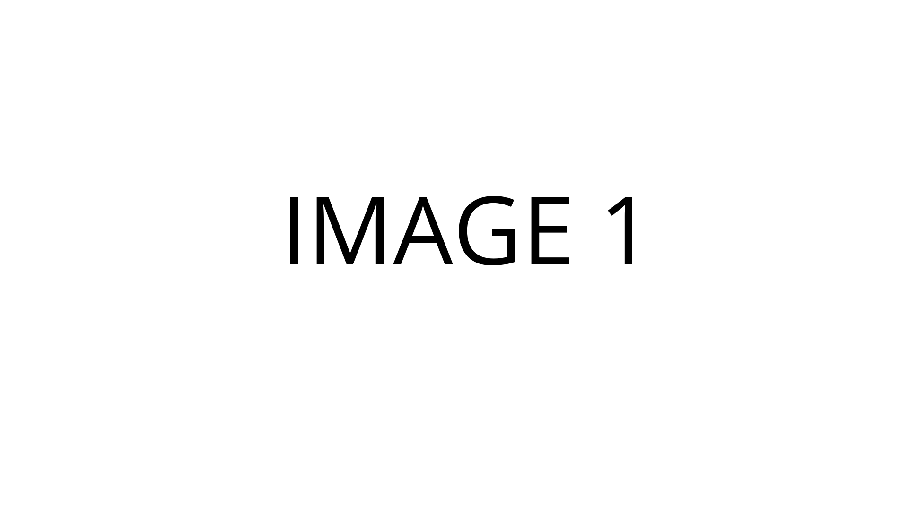
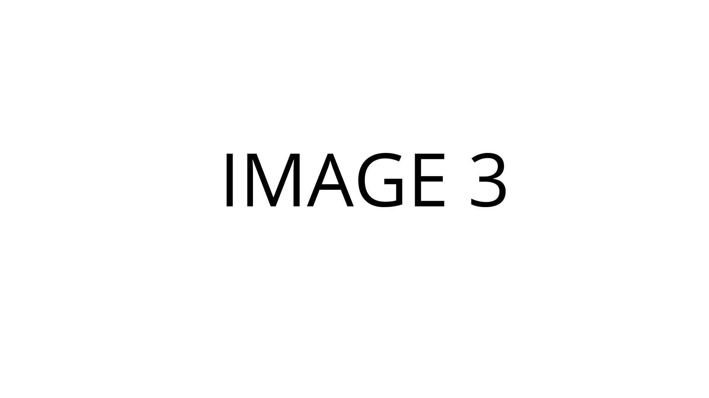
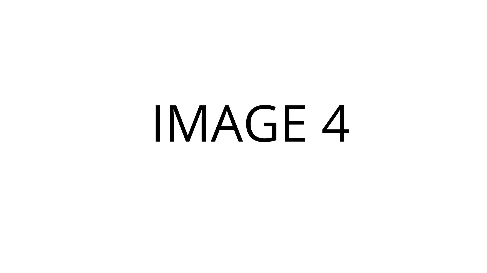

# 

## Factsheet

**Developer:**  
Company Name

**Release Date:**  
January 1, 20XX

**Platforms:**  
[Windows / Mac / Linux](http://link)  
[PS4](http://link)  
[Xbox One](http://link)  
[PlayStation Vita](http://link)  
[Nintendo DS](http://link)  

**Website:**  
[companydomain.com/exampleproject](http://companydomain.com/exampleproject)

**Regular Price:**  
USD	$100  
EU	€100

## Description

Lorem ipsum dolor sit amet, consectetur adipiscing elit, sed do eiusmod tempor incididunt ut labore et dolore magna aliqua. Ut enim ad minim veniam, quis nostrud exercitation ullamco laboris nisi ut aliquip ex ea commodo consequat. Duis aute irure dolor in reprehenderit in voluptate velit esse cillum dolore eu fugiat nulla pariatur. Excepteur sint occaecat cupidatat non proident, sunt in culpa qui officia deserunt mollit anim id est laborum.

## History

Lorem ipsum dolor sit amet, consectetur adipiscing elit, sed do eiusmod tempor incididunt ut labore et dolore magna aliqua. Ut enim ad minim veniam, quis nostrud exercitation ullamco laboris nisi ut aliquip ex ea commodo consequat. Duis aute irure dolor in reprehenderit in voluptate velit esse cillum dolore eu fugiat nulla pariatur. Excepteur sint occaecat cupidatat non proident, sunt in culpa qui officia deserunt mollit anim id est laborum.

## Features

* Cool things.
* Cool things.
* Cool things.
* Cool things.
* Cool things.

## Videos

Not a trailer, but here's some of the music! [Youtube](http://www.youtube.com/watch?v=hxQAUADFCzw "Motohiro Kawashima live")

<iframe src="//www.youtube.com/embed/hxQAUADFCzw" frameborder="0" allowfullscreen></iframe>

## Images

download all screenshots & photos as ** [.zip (63 KB)](assets/images/images.zip "Images zip") **

## Logo & Icon

download logo files as ** [.zip (7 KB)]( assets/images/logo.zip "Logo & Icon zip") **

## Awards & Recognition

> * "Winner, XX awards." - *December 13, 2013*
> * "Nominee, YY awards." - *December 13, 2013*

## Selected Articles

> * "Put a quote here, from someone who talked about your game."  
-- *Person Name, [Website](http://www.website.com/)*

> * "More quotes. Make sure to quote people properly! No trimming!"  
-- *Person name, [Site](http://geocities.blog.com/)*

## Additional Links

**Company Link #1**  
A link to something related can go [here](https://link)

**Company Link #2**  
Another link like this goes [here](https://link) if you want.

## About Company

**Company Link #1**  
Link to your company, or some affiliate. Located [here](https://link)

**Company Link #2**  
Another of these. See [here](https://link)

## Example Project Credits

**Probably the founder's name goes here**  
[Founder](https://link)

**Another person's name**  
[developer maybe](https://link)

**Another person, show em if you've got em**  
[artist, who knows](https://link)

**A fourth person**  
[music, sound?](https://link)

## Contact

**Inquiries**  
[press-contact@company.com][contact]

**Twitter**  
[twitter.com/companyname][twitter]

** Facebook**  
[facebook.com/companyname][facebook]

**Web**  
[companydomain.com][homepage]

<!--- =====================================================================  -->
<!--- Referenced links -->

[homepage]: http://companydomain.com "Company Name"

[contact]: mailto:press-contact@company.com

<!--- Social -->

[twitter]: https://twitter.com/companyname
[facebook]: https://facebook.com/companyname
